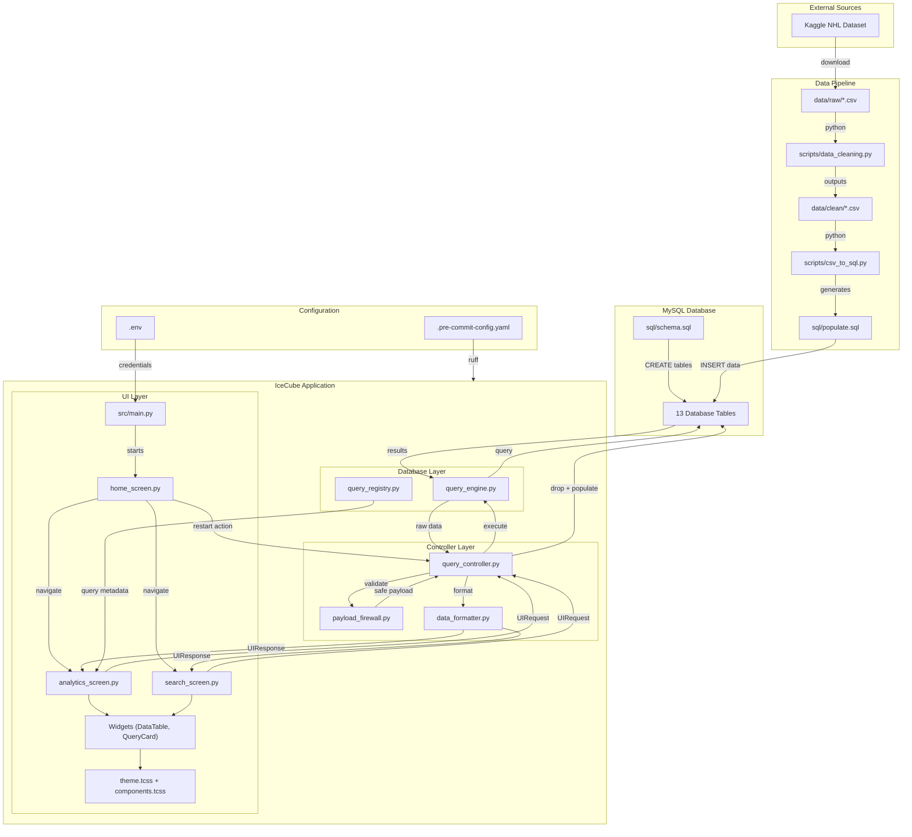

# ❄️ IceCube: NHL Analytics Engine

**A crystalline database management system for high-performance hockey analytics.**

IceCube is a terminal-based DBMS that makes digging through NHL stats *actually fun*. Built for the 2019-2020 season, it connects to a MySQL database and gives you a slick TUI (Text User Interface) with close to zero latency issues and proper data protection.

No bloated dashboards. No super slow queries. Just clean data, fast results.

---

## 🖼️ What It Looks Like


---

## ⚡ Why IceCube?

| Problem | How IceCube Solves It |
|---------|----------------------|
| **Slow queries** | TUI built with Textual — responds instantly, no browser overhead |
| **SQL injection attacks** | PayloadFirewall validates every input before it touches the DB |
| **Messy raw data** | Data cleaning scripts handle duplicates, nulls, and format issues |
| **Inconsistent code style** | Pre-commit hooks with Ruff keep everything clean on every commit |
| **Ugly terminal apps** | Custom CSS styling for a polished, readable interface |

---

## 🔒 Security That Actually Works

All user input goes through a **PayloadFirewall** before any query runs:

- Blocks dangerous tokens like `; -- /* */`
- Catches SQL keywords like `DROP`, `DELETE`, `UNION`, `EXEC`
- Detects boolean injection patterns (`OR 1=1`)
- Flags hex-encoded and base64-encoded attack payloads
- Normalizes unicode to prevent sneaky whitespace tricks


When someone tries something shady, IceCube catches it and shows a friendly "nice try" message.

---

## 🧹 Data Pipeline

The raw data from Kaggle isn't ready to use out of the box. IceCube includes scripts that:

1. **Clean the data** — removes unwanted columns, fixes date formats, handles nulls, drops duplicate rows, and filters to the 2019-2020 season only
2. **Convert to SQL** — takes the cleaned CSVs and generates `INSERT` statements for your database

Both scripts are in the `scripts/` folder and run with a single command each.

---

## 📁 Project Structure

```
ice-cube/
├── .github/workflows/           # GitHub Actions CI with Ruff linting
│   └── ci.yml
│
├── .pre-commit-config.yaml      # Pre-commit hooks for code quality
├── pyproject.toml               # Project metadata
├── requirements.txt             # Python dependencies
│
├── assets/                      # Screenshots and diagrams
│   ├── Analytics query screen.png
│   ├── UI theme menu options.png
│   ├── er diagram.png
│   ├── main home page with database repopulation.png
│   ├── search database screen.png
│   └── sql_injection_successfully detected.png
│
├── data/                        # Data files (gitignored, you create these)
│   ├── raw/                     # Raw CSVs from Kaggle
│   └── clean/                   # Cleaned CSVs after running the script
│
├── scripts/                     # Utility scripts
│   ├── data_cleaning.py         # Cleans raw CSVs → outputs to data/clean/
│   └── csv_to_sql.py            # Converts cleaned CSVs → sql/populate.sql
│
├── sql/                         # Database scripts
│   ├── schema.sql               # Creates all 13 tables
│   ├── drop.sql                 # Drops all tables (for refresh)
│   └── populate.sql             # Generated INSERT statements (you create this)
│
└── src/                         # Main application code
    ├── main.py                  # Entry point — run this
    │
    ├── controllers/             # Business logic layer
    │   ├── query_controller.py  # Routes UI requests to database
    │   ├── payload_firewall.py  # SQL injection protection
    │   └── data_formatter.py    # Makes query results pretty
    │
    ├── database/                # Database layer
    │   └── query_engine.py      # All SQL queries live here
    │
    ├── query_registry.py        # Maps query names to metadata
    │
    └── ui/                      # UI layer (Textual)
        ├── screens/             # App screens
        │   ├── home_screen.py
        │   ├── analytics_screen.py
        │   └── search_screen.py
        │
        ├── widgets/             # Reusable components
        │   ├── data_table.py
        │   ├── query_card.py
        │   ├── stat_panel.py
        │   └── loading_spinner.py
        │
        ├── styles/              # CSS for the TUI
        │   ├── theme.tcss
        │   └── components.tcss
        │
        └── mocks/               # Mock data for testing without DB
            └── mock_controller.py
```

---

## 🚀 Running It Locally

### What You Need
- Python 3.8+
- Access to a MySQL Server (or MSSQL)
- The NHL dataset from Kaggle

### Step-by-Step Setup

**1. Clone and install**
```bash
git clone https://github.com/yourusername/ice-cube.git
cd ice-cube
pip install -r requirements.txt
```

**2. Get the data**

Download the NHL dataset from Kaggle and extract the CSV files into `data/raw/`.

**3. Clean the data**
```bash
python scripts/data_cleaning.py
```
This reads from `data/raw/` and outputs cleaned files to `data/clean/`.

**4. Generate SQL inserts**
```bash
python scripts/csv_to_sql.py
```
This creates `sql/populate.sql` with all the INSERT statements.

**5. Set up your environment**

Create a `.env` file in the project root:
```env
DB_SERVER=your_server_address
DB_NAME=your_database_name
DB_USER=your_username
DB_PASSWORD=your_password
DB_REPOPULATION_TIME=60
```

**6. Run the app**
```bash
python src/main.py
```

**7. Populate the database**

Once the app starts, press `r` (Restart) to drop and repopulate all tables. The app reads `sql/schema.sql` and `sql/populate.sql` to set everything up.


---

## 🎯 Features & Queries

### Built-In Analytics

| Query | What It Does |
|-------|-------------|
| **Head-to-Head Duel** | Compare two players side by side |
| **Revenge Game Effect** | How players perform against old teams |
| **Home Rink Advantage** | Stats on home vs away performance |
| **Birthday Curse** | Do players choke on their birthday? |
| **Most Common Play Types** | What events happen most in games |
| **Top Shooting Teams** | Teams with the most shots |
| **Players with Most Assists** | Top playmakers |
| **Longest Games** | Epic overtime battles |

### Custom Search

Build your own queries with:
- Table selection dropdown
- Dynamic column picker
- WHERE clause input (protected by the firewall)
- Results displayed in a scrollable table

---

## 🧱 Architecture

IceCube uses a clean three-layer architecture:

| Layer | Responsibility | Key Files |
|-------|---------------|-----------|
| **UI** | Renders screens, handles keyboard input | `screens/`, `widgets/`, `styles/` |
| **Controllers** | Business logic, validation, formatting | `query_controller.py`, `payload_firewall.py` |
| **Database** | SQL execution, connection management | `query_engine.py` |

The UI never talks directly to the database. Everything flows through controllers.

---

## 🔧 Code Quality

Every commit goes through:

- **Ruff** — fast Python linter and formatter
- **Pre-commit hooks** — catches trailing whitespace, large files, YAML issues
- **GitHub Actions** — runs linting on every push

This keeps the codebase consistent across all contributors.

---

## 📐 ER Diagram
*Pls don't judge, its on paper rather than mermaid, but it covers the true essence of the dataset we used*


---

## 🔀 Data Flow Diagram



---

## 👥 Team

- Krisha Bhalala
- Varun Mulchandani
- Krish Bhalala

---

## 📜 License

MIT License — but please don't copy our code without understanding it first and learning from it + give some credits to us if you use our code.

---

*"You miss 100% of the queries you don't run."*
